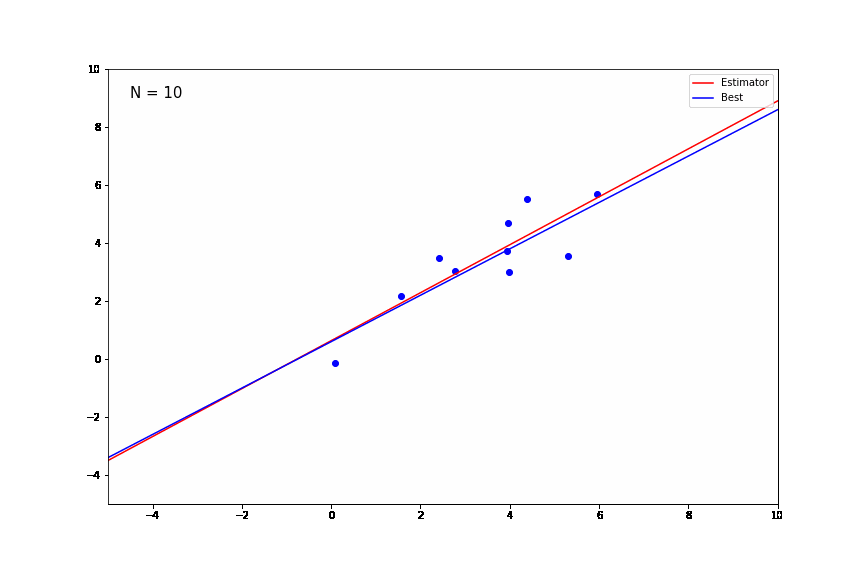

# Chapter 1: Introduction (Summary)

</img> 

   

<h4> <li>Marginal Probability (Sum Rule)</h4>
<ul>
  <li> $P(X) = \sum_{y} P(Y|X) P(X) \;\;\;  (Discrete)$
  <li> $P(X) = \int_{y} P(Y|X) P(X) \;\;\; (Continuous)$ 

</ul>

<h4> <li>Joint Probability (Product Rule)</h4>
    <ul>
        <li> $P(X, Y) = P(Y|X) P(X) = P(X|Y) P(Y)$
            </ul>
 
<li> <b>Discrete variable</b> => Probability mass function (PMF)
<li> <b>Continuous variable</b> => Probability density function (PDF)

   

<h4> The Gaussian distribution</h4>

$$
    \mathcal{N}(x | \mu, \sigma^2) = \frac{1}{\sqrt{2\pi\sigma^2}}e^{-\frac{1}{2\sigma^2}(x - \mu)^2}
$$

 
<li><b>For D-dimensional X:</b>
    
$$
    \mathcal{N}(x | \mu, {\sum}^{-1}) = \frac{1}{{(2\pi)}^{D/2}({\det(\sum)})^{1/2}}e^{-{1/2}{(x - \mu)^T\sum^{-1}(x - \mu)}}
$$

   

<h4> MLE & MAP</h4> 
<li> In frequentist settings, w is considered to be fixed pararameters(unique), whose values is determined by some estimator.
<li> The most widely used estimator is <b>Maximum Likelihood</b>. 
<li> w is parameter values that maximizes the likelihood function.
<li> In ML, the -log of the likelihood function is the error function.</li>

<h4> 1) Maximizing the likelihood function is equivalent to minimizing the error function.</h4>
  
    <ul>
        <li> Assume the following:
            <ul>
                <li> $y = W^TX + \epsilon$
                <li> $\epsilon$ is a random variable ~ $\mathcal{N}(0, {\sigma^2})$
                <li> $P(y | w, x) = \mathcal{N}(y | w^TX, \sigma^2I)$
            </ul> 
        <li> The likelihood function is:
            <ul>
                <li> $L(y_{1},..,y_{N}; w; X_{1},..,X_{N}) = \prod_{n=1}^{N} \mathcal{N}(y_{i} | w^TX_{i}, \sigma^2I) = \mathcal{N}(x | \mu, \sigma^2) = \frac{1}{{2\pi}^{N/2}\sigma^N}e^{-\frac{1}{2\sigma^2}(\sum_{N}(y_{i} - W^Tx_{i})^2)}$ 
                <li> So maximizing the liklihood is the same as minimizing the exponent, which is the error function(Least-mean-squares)
                <li> Max L $\equiv$ Min $\sum_{N}(y_{i} - W^Tx_{i})^2$
            </ul>
    </ul>
            
<h4> 2) Maximizing a posterior is equivalent to minimizing the regularized error function.</h4>
  
    <ul>
        <li> Assume the following:
            <ul>
                <li> $y = W^TX + \epsilon$
                <li> $\epsilon$ is a random variable ~ $\mathcal{N}(0, {\sigma^2})$
                <li> $P(w | t, x, \beta, \alpha) \propto P(t | x, w, \beta) P(w | \alpha)$
            </ul> 
        <li> MAP $\equiv$ Min $\sum_{N}(y_{i} - W^Tx_{i})^2 + (w-\mu_{w}).T\sum_{w}^{-1}(w-\mu_{w})$
             
        <li> After including $P(w | t, x, \beta, \alpha)$, we still making a point estimate of w </li>
</ul>
</ul>
            

   

<h4> Bayes' Theorem </h4> 
    <li> It's just manipulating a conditional probability.
    <li> We have two events, observed data (D) and the parameters (w). 
$$p(w | D) = \frac{p(D|w)p(w)}{p(D)}$$
 
<ul>
    <li> $P(w)$ : Information about w before observing D, it's our prior beliefs (domain knowledge).
    <li> $P(D | w)$ : The liklihood function, describes the effect of D on w, it tells how likely the observed data for different settings of w.    
    <li> $P(D)$ : The normalization constant, ensurs that the posterior distribution is a valid probability density. 
    <li> $P(w | D)$ : The posterior, reflects the probability of w after considering D. (the updated prior)   
</ul>      

   

<h4>Learning from data</h4>

<b>1)</b> Bayesian statistics tries to preserve and reifne uncertainty by adjusting our domain knowledge in light of new data. 
<b>2)</b> Frequentist statistics elimminate the uncertainty by providing an estimate(point estimate).
        

Given observed data $D=\{(x_{i}, y_{i})\}_{i=1}^N$. Dased on the observed data, find some way to predict new y given new x. 
We have three main approaches to solve the decision problems:
        
<ul>
    <li> <b>Generative models:</b>
        <ul>
            <li> Solve the inference problem to get $P(X , C_{k})$ for classification or $P(X , t)$ for regression.
            <li> Apply Bayes' theorem to get the posterior $P(C_{k} | X) = \frac{P(X, C_{k})}{P(X)}$ or $P(t | X) = \frac{P(X, t)}{P(X)}$
            <li> Apply the decision theory to find the class membership for classification.
        </ul> 
    <li> <b>Discriminative models:</b>
        <ul>
            <li> Solve the inference problem to get $P(C_{k} |X )$ for classification or $P(t | X)$ for regression directly.
            <li> No Bayes' theorem or $P(X)$.
            <li> Apply the decision theory to find the class membership for classification.
        </ul> 
    <li> <b>Discriminant function</b>
        <ul>
            <li> Find some function $F(X)$ that maps from $X$ to $C_{k}$ or $y$ directly.
            <li> In this case, probabilities play no role.
        </ul>
        </ul>

   
