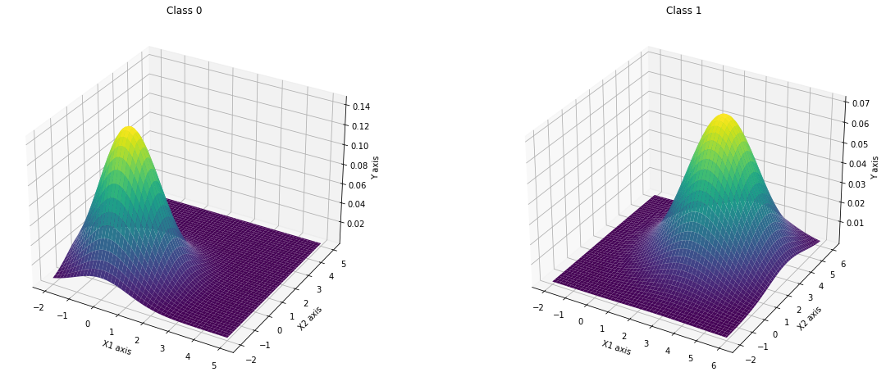
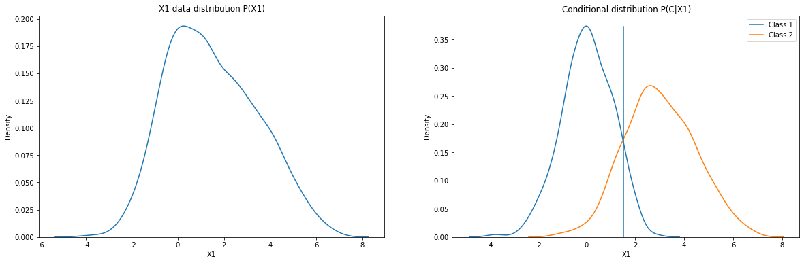
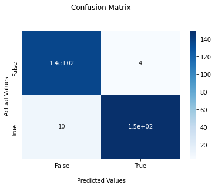

# Naive Bayes

## I'll:
  - Implement a simple gaussian NB algorithm.
  - Use the implementaion to fit a synthetic data.
  
 ## Assumption:
  - The data is sampled from a Gaussian distribution.
  - The problem is a binary classificaton problem.
  
 ## Results: 

