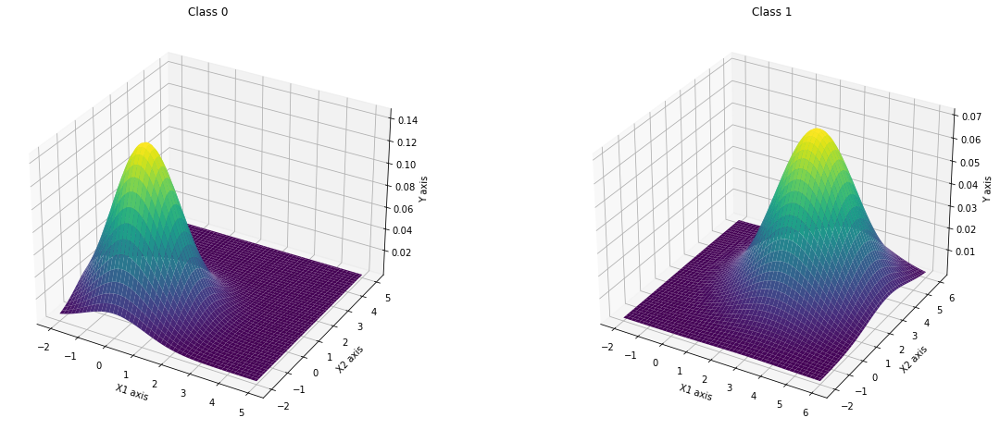
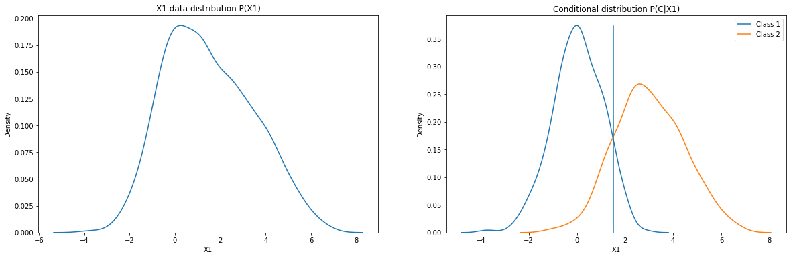
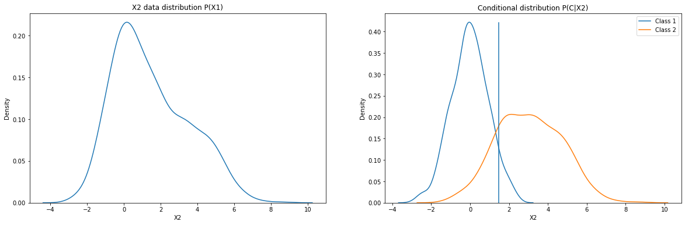
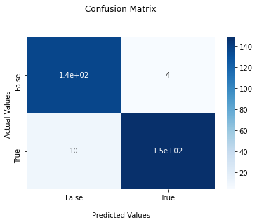

# Probabilistic Learning

## In this repository, I'll:
  - Implement a simple gaussian NB algorithm.
  - Use the implementaion to fit a synthetic data.
  
 ## Assumption:
  - The data is sampled from a Gaussian distribution.
  - The problem is a binary classificaton problem.
  
 ## Results: 

We can identify three distinct approaches to solving decision problems, all of which have been used in practical applications. 
### (a) Generative Models
  - First solve the inference problem of determining the class-conditional densities $P(x|C_{k})$ for each class Ck individually. Also separately infer the prior class probabilities $P(C_{k})$. 
  
  - Then use Bayes’ theorem to find the posterior class probabilities $P(C{k}|x)$ 
  $p(Ck|x) = \dfrac{P(x|C_{k})P(C_{k})}{P(x)}$ 
  As usual, the denominator in Bayes' theorem can be found in terms of the quantities appearing in the numerator, because 
  $P(x) = \sum_{n=1}^{k} p(x|Ck)p(Ck)$
  
  - Equivalently, we can model the joint distribution $P(x, C_{k})$ directly and then normalize to obtain the posterior probabilities. 
  - Having found the posterior probabilities, we use decision theory to determine class membership for each new input x. 
  - Approaches that explicitly or implicitly model the distribution of inputs like this are generative models, because by sampling from them it is possible to generate synthetic data points in the input space.

### (b) Discriminative models
  - First solve the inference problem of determining the posterior class probabilities $P(C_{k}|x)$
  - Then subsequently use decision theory to assign each new x to one of the classes. 
  
### (c) Discriminant function
  - Find a function $f(x)$, which maps each input x directly onto a class label. For instance, in the case of two-class problems, $f(·)$ might be binary valued and such that $f = 0$ represents class $C_{1}$ and $f = 1$ represents class $C_{2}$. 
  - In this case, probabilities play no role.

The classification problem can be brocken down into two separate stages:
  - The inference stage in which we use training data to learn a model for $P(C_{k}|x)$
  - The decision stage in which we use these posterior probabilities to make optimal class assignments.
